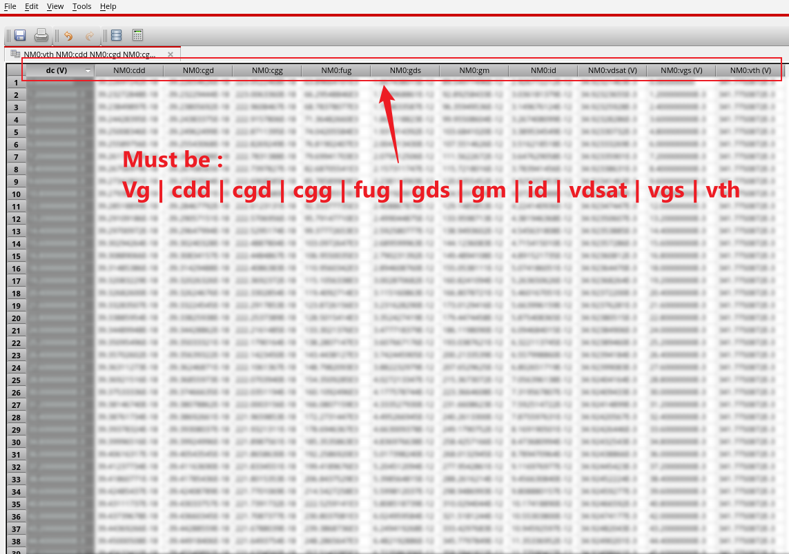

# Load Table

Back to [Document](Readme.md).

When you Load in a table, the header name must be like :

vg | cdd | cgd | cgg | fug | gds | gm | id | vdsat | vgs | vth

**Which mean YOU MUST to move the table header like the picture above.**

The program DO NOT CHECK the data in tables.

Please Reference the video in [QuickStart](./QuickStart.md).

## Program Principle

When you Load a table, the program will :

1. Load Tables to memory.
2. Split to multiple csv files and save in cache.
3. Getting Cache path to Load in the textbox.