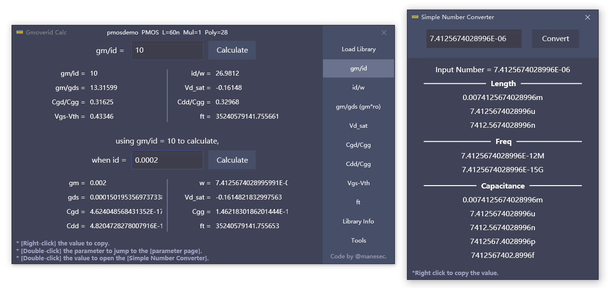

# [Deprecated] gmoverid-Calculator

**Deprecated due to lost access to the university servers.**

A C# version of gmoverid calculator.

[[Download](https://github.com/manesec/Gmoverid-Calculator/releases)]  [[Quick Start](./Document/QuickStart.md)]  [[Document](./Document/Readme.md)] [[Learn gm/id](./Document/Resource.md)]

You should know that what you are doing ;)

## Note
This is the first version, there are many features need to be improved. (I need some time)

If you find some problems, you can submit them in a GitHub issue (thank you).

## Why did I develop this software?

Because I want to make a software to get some parameters about gm/id in the shortest time without spending too much time.

[[More Screenshot](./Document/Screenshot.md)]

Please correct me if there are any mistakes !!

And, hope you like this ;)

## License
GNU GENERAL PUBLIC LICENSE Version 3.

## Know Issue
Give me some time to fix it :P 

+  ft and Id/W not good in 3.3V  (thanks for [大亚湾_凤凰男爵](https://space.bilibili.com/149169441)).

## TODO
+ Add Trained Cache and add delete all cache button.
+ Add Vds ~ gds tools.
+ Add auto test poly tools.
+ Range Limit.
+ Fix Windows 11 Windows Display Problem.
+ Detect CSV input Limit.

by [@manesec](https://github.com/manesec).
